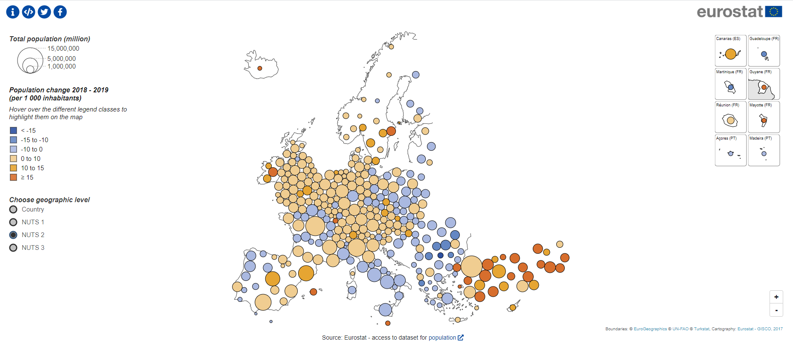

# NutsDorlingCartogram
Dorling cartograms from NUTS regions with Eurostat statistics

  

  
## Examples

* [Population without borders](https://eurostat.github.io/NutsDorlingCartogram/examples/dorling/)  
* [Population](https://eurostat.github.io/NutsDorlingCartogram/examples/population/)  
* [GDP](https://eurostat.github.io/NutsDorlingCartogram/examples/gdp/)  
* [Tourism](https://eurostat.github.io/NutsDorlingCartogram/examples/tourism/)  
* [Agriculture](https://eurostat.github.io/NutsDorlingCartogram/examples/agriculture/)  

## More details and source 
  
  See https://github.com/MarkG76/NutsDorlingCartogram
